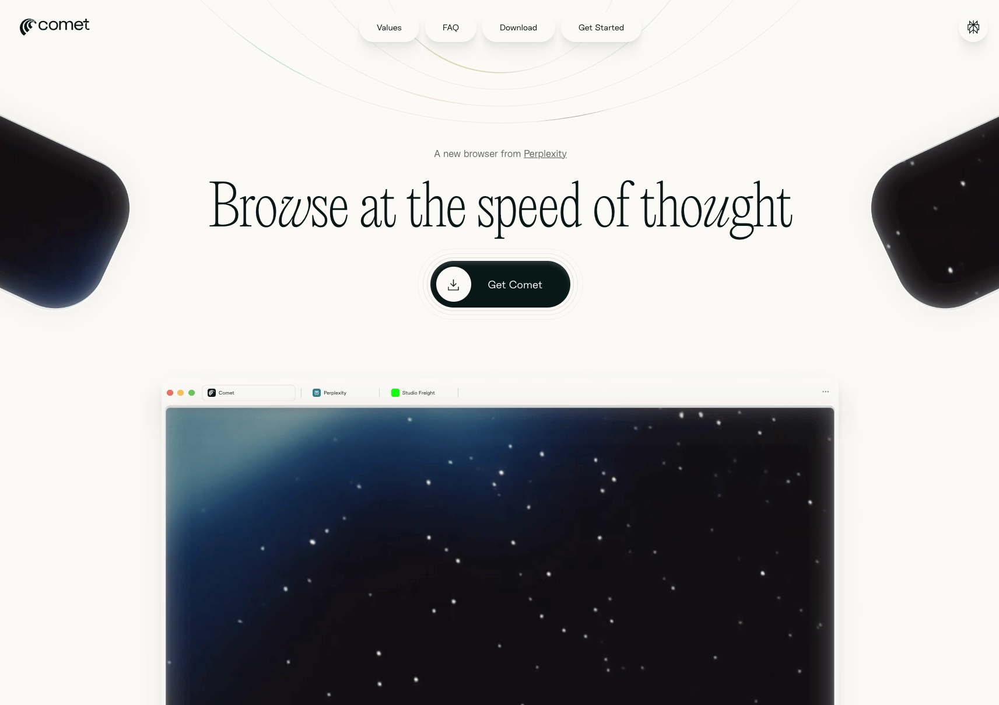

# 24小时深度体验：Perplexity AI的Comet浏览器，到底有多能打?

---

上周用了整整24小时Perplexity推出的Comet浏览器。说实话，刚开始我也没抱太大期望——又一个"AI革命"的噱头而已。但用到第三个小时，我开始意识到：这玩意儿可能真的会改变我们上网的方式。

想象一下：你不用再开十几个标签页比价、填表、收确认邮件。只需要跟浏览器说一句"帮我订下周五晚上7点台北的米其林中餐厅，5个人，别选海鲜"，然后该干嘛干嘛去。回来一看，餐厅订好了，菜单链接也给你整理好了。

这就是Comet想做的事：把你从重复劳动里解放出来。

---

## 什么是Comet？简单说就是把AI助理塞进了浏览器

Comet基于Chromium内核，兼容大部分Chrome扩展。但它跟普通浏览器最大的区别在于：每个标签页背后都有个"数字管家"。

打开侧边栏，你可以像跟朋友聊天一样下指令：
- "查今年11月北海道滑雪的精品旅馆，预算一晚9000台币"
- "找东京哪里买Switch 2最便宜"
- "帮我对比这三款笔记本的参数"

那些原本需要你开一堆网页、手动复制粘贴、来回切换的琐事，现在AI全包了。你唯一要做的，是学会"放手"。

## 从"盯梢"到"甩手掌柜"：心态转变才是关键

老实说，前两小时我完全是"监工模式"：下完指令就死盯着AI填表，生怕它填错信用卡号。结果效率奇低，比自己动手还慢。

后来我强迫自己离开座位去泡咖啡。回来一看，AI已经把三家餐厅的订位状态整理成表格，还附上了菜单链接和用户评价。那一刻我才明白：**把时间还给自己，把琐碎留给AI，这才是"代理式浏览"的真正意义。**

## 真实场景测试：三个任务同时跑

我给Comet布置了三个任务：
1. 找北海道滑雪旅馆（预算9000台币/晚）
2. 对比三款游戏本性能参数
3. 查下周台北米其林中餐厅订位

整个过程我只打了三段话。AI自动开了十几个网页、滚动页面比价、截图重点信息，最后把摘要贴回侧边栏。我则专心写完了手头的文章。

**这种"分身术"的感觉，确实很上头。**如果你也经常被多任务搞得焦头烂额，👉 [想要更高效的AI工具帮你省时间？Perplexity Pro年费成品号现在24小时自动发货，365天质保](https://shaoyumi.com/buy/64)，直接用上完整版功能，不用排队等测试资格。

## 目前的毛病：Beta版该有的"坑"

当然，Comet现在还是测试版，有些地方确实让人不太放心：

**个人信息安全感不足**  
AI需要信用卡号、护照信息才能完成订房，但Beta版我还不敢全权托付。

**流程中断问题**  
遇到验证码或3D验证时，AI会卡住，需要手动接手。

**语言切换混乱**  
有些日文酒店官网被自动翻成英文，导致房型名称对不上。

这些都是早期产品的常见问题。官方表示未来会加入"一次性虚拟卡"和"人机混合接管"机制来解决。

## 不只是浏览器，更像是你的"网络分身"

用了24小时后，我对Comet的感受是：**它让我第一次觉得AI不只是工具，而是可以信赖的网络分身。**

以前上网是"我操作电脑"，现在变成了"我下指令，AI去跑腿"。这种关系的转变，才是真正的革命性变化。

而且这场战争才刚开始——OpenAI昨天（7/17）也推出了类似的ChatGPT Agent，浏览器大战2.0正式开打。

## Reddit社群怎么看Comet？

从Reddit上的讨论来看，大家对Comet的评价呈现两极分化：

**赞成方**：多任务处理能力、自动化工作流程、省时间  
**质疑方**：价格太贵（月费200美元）、隐私安全、资源占用高

有人每天用它排程任务、自动购物；也有人觉得"投资时间比花钱更省"。但多数用户的共识是：**如果你经常需要同时处理多个信息源、喜欢自动化日常任务，Comet确实是颠覆性工具。**

## Perplexity Max值不值？社群这么说

Comet目前只对Max订阅用户开放（月费200美元）。Reddit上的讨论基本分成两派：

**觉得不值派**：跟20美元的Pro版相比，Max附加价值不足以抵消900%的价格涨幅  
**觉得划算派**：如果每月能省下大量时间，200美元其实不算贵

大多数人的建议是：**先用Pro版试试水，确定自己是重度用户再考虑升级Max。**普通用户的需求，Pro版基本都能满足。

## 几个常见问题

**隐私安全怎么样？**  
Perplexity表示主要数据本地存储，只在必要时传输最少信息给服务器。如果特别在意隐私，可以用无痕模式。

**比Chrome、Safari快吗？**  
资源占用略高，但工作流程效率整体提升。AI助手能省去在不同网站间反复切换的时间。

**有Windows ARM或Linux版本吗？**  
目前只支持Windows x64和macOS，Windows ARM用户反映有兼容性问题。

---

## 结语

24小时体验下来，Comet最大的价值不是"更快的浏览器"，而是让我们重新思考"人和网络的关系"。当代理式AI越做越好，我们将从"操作互联网"转向"指挥互联网"。

对于经常被多任务搞得焦头烂额的人来说，👉 [Perplexity Pro年费成品号让你省去排队等测试资格的时间，24小时自动发货，365天质保](https://shaoyumi.com/buy/64)，直接用上完整版Perplexity的所有功能，包括更强大的AI模型和更快的响应速度——这才是真正把时间还给自己的方式。
